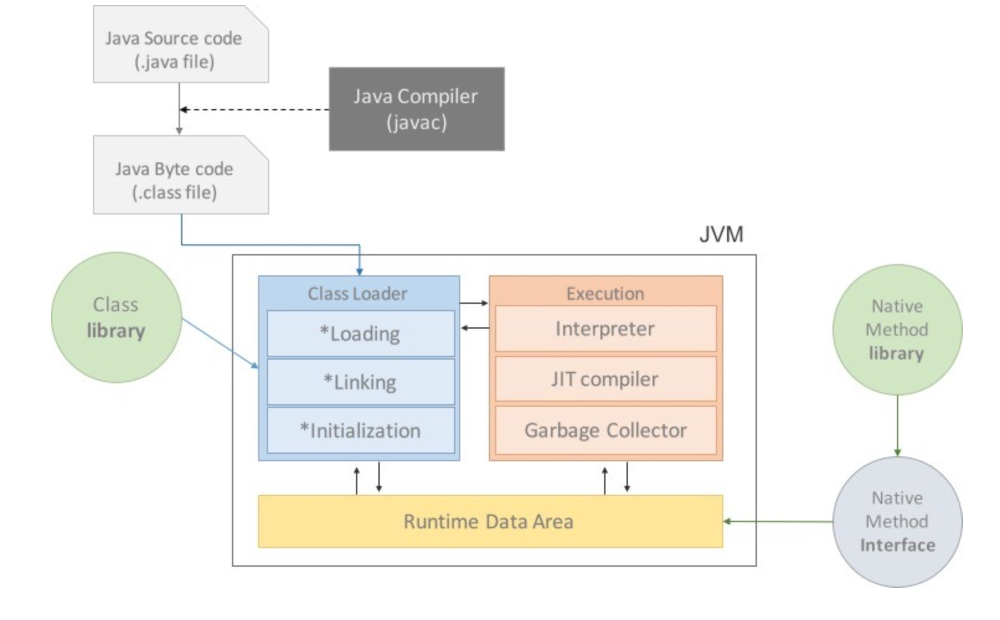
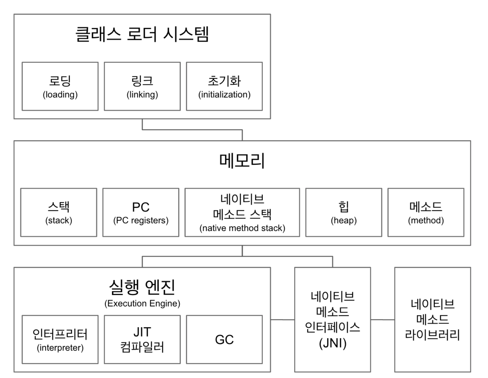
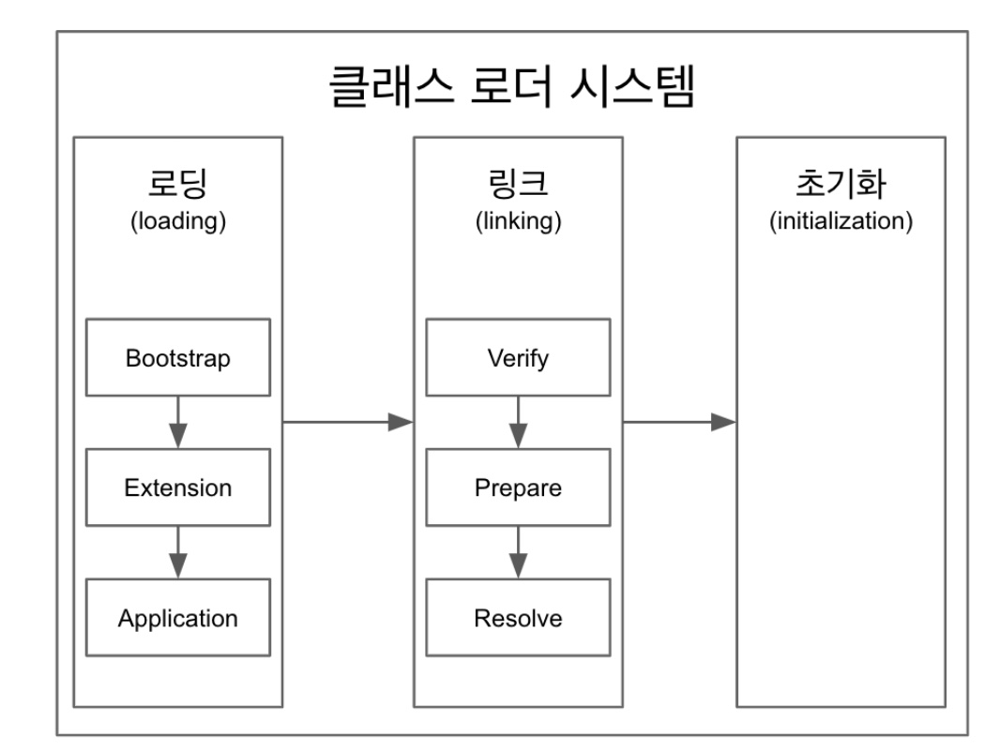
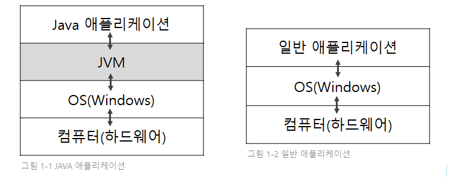
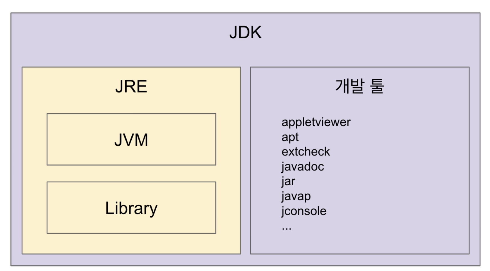

> 해당 글은 백기선의 온라인 자바 기초 스터디 목차를 바탕으로 학습한 내용입니다.  
> [1주차 과제: JVM은 무엇이며 자바 코드는 어떻게 실행하는 것인가. · Issue #1 · whiteship/live-study](https://github.com/whiteship/live-study/issues/1)

## 자바언어의 특징

### 1. 운영체제(OS__Operating System)에 독립적

#### 프로그래밍 언어의 역사

운영체제에 독립적이라는 의미에 대해 설명하기에 앞서 프로그래밍 언어의 발전을 간단하게 알아보면 더 이해하기 쉽다. 처음 컴퓨터가 탄생했을 때, 그리고 아직까지도 **컴퓨터는 전기 펄스의 연결과 해제를 통해 동작** 한다. 이를 조금 더 공학적인 관점에서 이야기하자면 `0` 과 `1` 이라는 **이진법(binary number)으로 컴퓨터의 모든 작업이 동작** 한다는 의미다.

#### 기계어 (Machine Language)

앞서 언어의 역사에서 소개한 것처럼 **`0` 과 `1` 로만 작성돼 기계가 쉽게 이해할 수 있는 언어** 가 기계어다. 예를 들어 에드삭(EDSAC)과 유니박(UNIVAC)에서 각각 `1` 과 `3` 을 더하는, 다시 말해 `1 + 3` 을 표현하는 기계어 코드는 아래와 같다.

```
EDSAC:  01010101 00000001 00001001
UNIVAC: 11011100 00011000 10011000 
```

#### 어셈블리어 (Assembly Language)

위 기계어 예시를 보면 알겠지만 간단한 더하기 연산만 하더라도 굉장히 코드가 복잡해진다. 그래서 컴퓨터가 이해하기는 쉬워도 이를 작성하는 사람 입장에서는 무척 복잡하며 이에 따라 유지보수 같은 측면에서 무척 비효율적이다. 이를 해결하려고 등장한 게 바로 어셈블리어다. **기계어를 인간이 사용하는 일상 용어, 다시 말해 자연어(Natural Language)로 표현한 뒤 이를 어셈블러(Assembler)라는 일종의 번역기를 통과시켜 기계어로 바꿔주는 방식으로 프로그래밍** 을 하는 것이다. 예를 들면 기계어 `01010101` 이 더하기를 의미했다면 이에 매칭되는 어셈블리어를 `ADD` 라고 사용하여 `ADD` 를 사용하면 어셈블러가 자동으로 `01010101` 로 번역해 더하기 연산을 수행하는 것이다.

#### 고급 언어 (High-Level Language): C

기계어와 어셈블리어에 비해 인간의 언어, 다시 말해 자연어에 더 가깝기 때문에 고급 언어라 부른다. 우리가 현재 흔하게 사용하고 있는 C, C++, Java, Python, JavaScript 등이 바로 고급 언어에 속한다. 그 중 C언어의 경우 기존 EDSAC의 소스파일이 EDSAC 어셈블러를 통해서만 동작하여 이식성이 떨어졌던 것에 비해 단 하나의 소스 파일 만으로 컴파일러를 통해 이를 번역해 작업을 수행했다. **그러나 운영체제 별로 `int` 크기에 차이가 있는 등의 소스에 대한 수정이 필요** 했다.

#### 고급 언어: Java

자바언어의 경우 C언어와 달리 **JRE(Java Runtime Environment)를 한 번만 설치하면 이를 통해 운영체제 별로 소스 코드를 재작성해야 할 필요 없이** 윈도우에서 작성한 코드를 그대로 리눅스에서 사용 가능했다. 이와 관련되어 나오는 개념이 JVM(Java Virtual Machine)인데 이에 대해서는 뒤에서 더 자세히 살펴보고자 한다. 결론적으로 이러한 가상 머신의 도움으로 자바는 **WORA(Write Once Run Anywhere)** 를 구현할 수 있게 됐다.

### 2. 객체 지향 언어

#### 객체 지향 프로그래밍 (OOP__Object Oriented Programming)

객체 지향 프로그래밍이란 **프로그래밍의 패러다임** 중 하나다. 쉽게 생각해서 개발 할 때 개발자가 갖는 일종의 철학이라고 생각하면 편하다. 객체 지향의 특징과 여러 관련된 내용들을 소개하는 데 한계가 있기 때문에 간단하게 **실세계의 사물들을 비유하여 개발하는 방법** 이라고 생각하면 편하다. 이에 대해서는 차후 객체 지향 챕터에서 더 자세히 다뤄보고자 한다.

### 3. 자동 메모리 관리 (GC__Garbage Collection)

자바로 프로그램을 동작시키면 가비지 컬렉터(GC__Garbage Collector)가 **자동적으로 메모리를 관리**해주기 때문에 개발자는 별도로 메모리 관리에 신경 쓰지 않아도 괜찮다. 이는 기존의 언매니지드 언어(unmanaged language)인 C언어나 C++와 큰 차이점으로 이전에 `free()` 와 같은 메서드를 호출하여 메모리를 해제하고 메모리 누수(memory leak)를 방지했던 것과는 달리 가비지 컬렉터가 이를 대신 **자동으로 수행해 메모리 누수를 방지**한다는 점이다. 얼핏 들었을 때는 개발자의 업무를 덜어주고 기존 메모리 해제를 잘못하여 발생할 수 있는 여러 문제점을 예방해줘서 좋다고 판단할 수도 있으나 직접 메모리 관리를 하지 않기 때문에 아무래도 **더 비효율적**일 수밖에 없다는 단점이 있다.

### 4. 네트워크와 분산처리를 지원

다양한 네트워크 프로그래밍 라이브러리(Java API)를 지원해주기 때문에 효율적으로 네트워크 관련 프로그램을 개발할 수 있다. 

> 잠깐! 네트워크 프로그래밍(Network Programming)이란 무엇을 의미할까?
> 
 >네트워크 프로그래밍은 독립적인 두 개의 디바이스, 다시 말해 컴퓨터나 인터넷 또는 컴퓨터나 컴퓨터 등이 서로 네트워크를 통해 데이터를 주고 받을 수 있게 프로그래밍 하는 것을 의미한다. 쉽게 말해 내가 서울에서 컴퓨터를 통해 부산에 있는 친구의 휴대폰으로 과제 자료를 보내주는 상황을 생각해보면 쉽다.

#### API (Application Programming Interface)

애플리케이션 프로그래밍 인터페이스, 줄여서 API라고 부르는 이것은 어떤 응용 프로그램, 다시 말해 **애플리케이션이 사용할 수 있도록 프로그래밍 언어 등이 제공하는 인터페이스** 를 의미한다.

쉽게 설명하면 커피를 주문하는 과정을 예로 들 수 있다. 우리는 커피숍에 들어 가서 본인 마음 대로 커피를 주문할 수 없다. 줄을 서고 계산대에 가서 캐셔에서 주문을 한 뒤 결제의 과정을 거쳐 이후 주문한 커피를 제공 받는다. 여기서 손님과 커피를 만드는 바리스타를 각각의 프로그램이라고 생각하면 주문(요청__Request)과 커피를 전달 받는(응답__Response) 과정을 중간에서 연결해주는 캐셔가 곧 API가 되는 것이다. API는 이렇게 중간에서 커피, 다시 말해 데이터가 잘 상호작용 할 수 있게 도와주는 매개체 역할을 한다.

보통 이러한 과정에서 데이터를 요청하는 곳을 클라이언트(Client), 데이터를 전달하는 곳을 서버(Server)라 하는데 모바일 애플리케이션의 경우 요청하는 모바일 애플리케이션을 컨슈머(Consumer), 데이터를 전달하는 백엔드 애플리케이션을 프로바이더(Provider)라 부른다.

> 잠깐! 인터페이스(interface)란 무엇을 의미할까?
> 
> 인터페이스는 일종의 접점면을 의미한다. 다시 말해 서로 다른 두 개의 시스템이 어떤 데이터를 주고 받을 때의 그 경계를 의미하는 데 위 API와 네트워크 프로그래밍 정의에서 나온 예시를 통해 생각해보면 서울의 컴퓨터에서 부산의 휴대폰으로 데이터를 전달 할 때 그 데이터가 송수신 되는 중간의 역할이라고 생각하면 편하다.

### 5. 멀티 스레드 지원

**일반적인 멀티 스레드는 운영체제에 따라 구현 방법과 처리 방식이 상이** 한데 자바의 경우 **시스템과 상관 없이 멀티 스레드를 구현** 할 수 있으며 관련된 라이브러리를 제공해주고 스케줄링 또한 자바 인터프리터가 담당하기 때문에 쉽게 멀티 스레드 환경을 구현할 수 있다. 

### 6. 동적 로딩(Dynamic Loading) 지원

동적 로딩을 통해 **자바 애플리케이션을 실행할 때 모든 클래스를 로딩하지 않고 필요한 시점에 필요한 클래스를 로딩** 할 수 있다. 더욱이 일부 클래스에서 수정 사항이 발생해도 전체 애플리케이션을 다시 컴파일하지 않아도 되기 때문에 유연한 작업이 가능하다.

## 자바 프로그램의 실행 과정

### 과정



1. 프로그램이 실행되면 JVM은 운영체제로부터 필요한 메모리를 할당 받고 메모리 용도에 따라 영역을 나누어 관리한다.
2. 자바 컴파일러( `javac` )가 자바 소스 코드( `.java` )를 읽어들여 자바 바이트코드( `.class` )로 변환시킨다.
3. 클래스 로더를 통해 `class` 파일들을 JVM으로 로딩한다.
4. 로딩된 파일들은 실행 엔진(Execution Engine)을 통해 해석된다.
5. 해석된 바이트코드는 Runtime Data Area에 배치되어 실직적인 애플리케이션 작업이 이루어진다.

> 이때 이러한 실행 과적 속에서 스레드 동기화(Thread Synchronization) 또는 GC(Garbage Collection)와 같은 관리작업을 수행한다.

### JVM 구성

아래는 JVM 구성과 함께 JVM 영역으로 넘어 온 자바 프로그램이 실행되는 과정을 간략하게 이미지로 나타낸 것이다. 그 과정을 간략하게 글로 풀어 내면 다음과 같다.

클래스 로더 시스템으로 넘어 온 바이트코드는 메모리 영역으로 넘어 가 글로벌하게 또는 개별적인 스레드 별로 공유되며 이때 실질적으로 소스 코드를 실행시키기 위해 실행 엔진으로 넘어 가서 인터프리터, JIT 컴파일러 과정을 거쳐 효율적으로 실행되며 메모리 누수 방지 등과 같은 관리를 위해 GC가 동작한다. 그리고 이러한 과정 중 C언어 또는 C++로 작성된 경우 네이티브 메서드 영역으로 넘어가서 실행된다.



#### 클래스 로더 (Class Loader)

`.class` 에서 바이트코드를 읽고 메모리에 저장한다. 이때 **클래스 로더는 계층형 구조** 다. 클래스 로더에서 이뤄지는 작업들을 이미지로 나타내면 아래와 같다.



1. **로딩 (Loading)** : **클래스 로더가 `.class` 파일을 읽고** 그 내용에 따라 적절한 **바이너리 데이터를 만들어 메서드 영역에 저장** 한다. 이때 메서드 영역에 저장하는 데이터는 FQCN(Fully Qualified Class Name), 클래스인지 인터페이스인지 이넘(ENUM)인지 구분, 메서드, 변수가 있다. **로딩이 끝나면 해당 클래스 타입의 `Class` 객체를 생성하여 힙 영역에 저장** 한다.

    > FQCN(Fully Qualified Class Name)이란 해당 클래스가 속한 패키지 경로까지 포함한 이름을 의미한다.

    이때 로딩 단계에서 이뤄지는 클래스 로더의 종류로는 세 가지가 있다.

    1. **부트 스트랩(Bootstrap)**: 최상위 클래스 로더로 항상 최우선순위를 갖는다. `JAVA_HOME\lib` 에 있는 코어 자바 API를 제공한다.
    2. **플랫폼 (Platform)**: 예전에는 익스텐션(Extension)이라고 불렀다. `JAVA_HOME\lib\ext` 폴더 또는 `java.ext.dirs` 시스템 변수에 위치한 클래스를 읽는다.
    3. **애플리케이션 (Application)**: 애플리케이션을 실행할 때 주는 `-classpath` 옵션 또는 `java.class.path` 환경 변수의 값에 해당하는 위치에 존재하는 클래스패스에서 클래스를 읽는다.

2. **링크 (Link)** : **레퍼런스를 연결** 하는 과정을 의미하는 데 세 단계로 나눠져 있다.
    1. **검증 (Verify)** : `.class` 파일이 유효한지 체크한다.
    2. **준비 (Prepare)** : 클래스 변수( `static` 변수)와 기본값에 필요한 메모리를 준비하는 과정이다.
    3. **분석 (Resolve)** : 심볼릭 레퍼런스를 메서드 영역에 있는 실제 레퍼런스로 교체하는 데 이는 선택적으로 이때가 아닌 나중에 해당 레퍼런스를 실제로 사용할 때 발생할 수도 있다. 다시 말해 논리적인 레퍼런스를 실제 물리적인 레퍼런스로 바꾸게 되는데 이 과정이 링크 단계가 아닌 실제로 참조해서 사용할 때 발생하기도 하기 때문에 선택적이다.
3. **초기화 (Initialization)** : **`static` 값을 초기화하거나 변수에 할당** 하는 과정을 의미한다.

#### 메모리

우선 메모리 공간에 대해 이해할 필요가 있다. **운영체제는 메모리(RAM__Random Access Memory)에 프로그램을 할당** 해주는 데 이때 4가지 공간으로 나누어 할당해준다. 이를 쉽게 나타내면 아래 이미지와 같다.


1. **코드 영역 (Code Area)** : 작성한 **소스 코드** 가 들어가는 부분이다. **텍스트 영역(Text Area)** 이라고도 한다.
2. **데이터 영역 (Data Area)** : **전역 변수와 `static` 변수가 할당** 되는 영역이다. **프로그램 시작과 동시에 할당되며 프로그램이 종료되면 자동으로 소멸** 된다. 
3. **힙 영역 (Heap Area)** : **개발자가 할당 / 해제하는 영역**으로 C언어와 C++에서는 `free()` 를 사용하지만 **자바에서는 GC가 자동으로 이를 해제** 해준다. **이 공간에 메모리를 할당하는 것을 동적 할당(Dynamic Memory Allocation)이라 한다.** 
4. **스택 영역 (Stack Area)** : **임시 메모리 영역**으로 **함수가 호출 될 때 생성되는 지역 변수와 매개변수가 저장** 되는 영역이다. 함수 호출이 끝나면 소멸된다.

자바 또한 위 메모리 영역을 기반으로 한다. 그리고 크게 두 가지로 나뉘는 데 **글로벌하게 공유되는 영역** 과 **개별 스레드 내에서만 공유되는 영역** 이다.

우선 아래 두 가지는 **글로벌하게 공유** 되는 영역이다.

1. **메서드 (Method)**: **클래스 수준의 정보**인 클래스 이름, 패키지 정보, 부모 클래스 이름, 메서드, 변수 등이 저장된다. 이때 해당 공간에는 **런타임 상수 풀(Runtime Constant Pool)** 이라는 관리 영역이 존재하여 **상수 자료형을 저장하여 참조하고 이것이 중복되는 현상을 막아준다.** 
2. **힙 (Heap)** : 실제 **인스턴스를 저장하는 가상 메모리 공간** 이다. 다시 말해 `new` 생성자를 통해 생성된 객체를 저장한다. 이때 힙은 크게 세 가지 영역으로 구분되는 데 이는 변수 파트에서 더 자세히 알아보고자 한다.

아래는 **개별 스레드에 국한** 되는 메모리 영역이다. 따라서 사용되는 해당 스레드에서만 공유 되며 메서드, 힙과 같이 글로벌하게 공유되지 않는다.

1. **스택 (Stack)**: 스레드마다 런타임 스택을 만들고 그 안에 **메서드 호출을 스택 프레임이라 부르는 블럭으로 쌓는다.** 이는 실행시킨 자바 프로그램에서 오류가 발생하여 오류 메세지를 출력해줄 때 쌓여있는 메서드 호출 스택을 통해 알 수 있다. 이렇게 **스레드 내에서의 생명 주기를 가진 데이터를 저장** 하는 영역이기 때문에 메서드 내에서 사용되는 **지역 변수(local variable)** 등이 저장된다. 또한 이러한 특징으로 스레드를 종료하면 런타임 스택도 사라진다.
2. **PC 레지스터 (Program Counter Register)** : 스레드마다 **스레드 내 현재 실행 할 스택 프레임을 카리키는 포인터가 생성되는 곳** 이다. 이를 통해 호출한 메서드가 어떤 스레드에서 스택 프레임으로 쌓여 있는지 알 수 있다.
3. **네이티브 메서드 스택 (Native Method Stack)** : **네이티브 메서드를 호출** 할 때 사용되는 스택이다.

#### 네이티브 메서드 인터페이스 (JNI__Java Native Interface)

자바 애플리케이션에서 C언어와 C++, 어셈블리로 작성된 함수를 사용할 수 있는 방법을 제공해준다. 이때 `Native` 키워드를 사용한 메서드를 호출한다.

#### 네이티브 메서드 라이브러리

C언어와 C++로 작성된 라이브러리다. 대표적인 예로 `currentThread()` 가 있다. 이러한 라이브러리들은 반드시 JNI를 통해서만 실행시킬 수 있다.

#### 실행 엔진 (Execution Engine)

**클래스를 실행시키는 역할**을 한다. 다시 말해 클래스 로더를 통해 런타임 데이터 영역에 배치된 바이트 코드가 실행 엔진에 의해 실행된다. 이때 실행 엔진은 크게 세 부분으로 나눌 수 있다.

1. **인터프리터 (Interpreter)** : **바이트 코드를 한 줄씩 이해** 하여 실행시킨다. 
2. **JIT 컴파일러** : 인터프리터 효율을 높이기 위해 **반복되는 코드를 발견하면 해당 컴파일러를 통해 이를 네이티브 코드로 바꿔둔다.** 그리고 인터프리터는 바뀌어진 네이티브 코드로 컴파일 된 코드를 바로 사용한다.
3. **GC(Garbage Collection)** : **더이상 참조되지 않는 객체를 모아서 정리** 하는 역할을 한다. 경우에 따라 커스터마이징을 통해 옵션을 바꾸거나 또는 프로그램에 따라 GC를 선택해야 하기 때문에 실행 엔진에서 꼭 이해해야 하는 부분이다.

#### 결론

JVM은 크게 **클래스 로더(Class Loader)** , **실행 엔진(Execution Engine)** , **런타임 데이터 영역(Runtime Data Area)** 으로 나뉜다. 이때 **런타임 데이터 영역** 은 **메모리** , **JNI** , **네이티브 메서드 라이브러리** 로 구성되어 있다. 더 자세한 런타임 데이터 영역에 관한 내용은 변수와 객체 부분 이후 알아보고자 한다.

소스 코드가 실행되는 과정을 한 줄로 요약해보자면 클래스 로더를 통해 바이트코드가 런타임 데이터 영역으로 배치되고 이것이 실행 엔진에서 실행된다.

## JVM, JRE, JDK

### JVM (Java Virtual Machine)

#### 정의

자바 가상 머신(Java Virtual Machine)은 자바 바이트 코드( `.class` )를 운영체제에 특화된 코드로 변환하여 실행한다. 이때 **인터프리터(Interpreter)** 와 **JIT(Just-In-Time) 컴파일러** 를 활용한다.

아래 이미지는 Java 애플리케이션과 일반 애플리케이션의 차이점이다. Java는 앞서 WORA 특징을 갖는다고 이야기 했었는데 이는 곧 JVM을 통해서 가능하다고 말했다. JVM 자체는 운영체제에 종속적이지만 일반 애플리케이션과 달리 Java 애플리케이션의 소스 코드는 운영체제에 맞게 수정할 필요 없이 아래 이미지처럼 애플리케이션이 JVM에 종속적이기 때문에 JVM만 OS에 맞게 구성해준다면 동일한 소스 코드로 어디에서나 같은 애플리케이션의 수행 작업물을 얻을 수 있다.



이러한 과정에서 일반 애플리케이션과 달리 Java 애플리케이션은 JVM을 거치기 때문에, 그리고 하드웨어에 맞게 완전히 컴파일 된 상태가 아니고 실행 시에 해석(interpret)되기 때문에 속도가 느리다는 단점이 있다. 이를 보완하기 위해 바이트코드를 기계어로 바로 변환해주는 JIT 컴파일러를 활용한다.

### JRE (Java Runtime Environment)

#### 정의

자바 애플리케이션을 실행할 수 있도록 구성된 배포판을 의미한다. 앞서 JVM을 통해 자바의 소스 코드가 운영체제 별로 동작하는 방법에 대해 알아봤다. JVM만을 통해서 애플리케이션의 동작이 정상적으로 이루어지지 않는데 해당 애플리케이션을 실행할 수 있게 만들어주는 라이브러리 등이 필요하기 때문이다. 따라서 JRE는 이러한 **JVM과 라이브러리를 합쳐 놓은 환경** 이라 생각하면 편하다. 쉽게 말해 자바 애플리케이션을 실행할 수 있게 필요한 것들이 들어 있는 곳이다.

 
### JDK (Java Development Kit)

#### 정의

JRE는 JVM과 라이브러를 포함한 개념이기는 하지만 개발 관련 도구는 포함하고 있지 않다. 이때 자바 애플리케이션을 실행할 수 있는 실질적인 **개발 관련 도구가 JDK에서 제공** 된다. 쉽게 설명하면 컴파일러, jar와 같은 개발 도구들과 JRE가 합쳐진 것, 다시 말해 **JVM, 라이브러리, 개발 관련 도구가 들어 있는 곳** 이다.

> 오라클에서 제공하는 자바 11부터는 JDK만 제공하며 JRE를 따로 제공하지 않고 있다. 왜냐하면 자바 9부터 `jlink` 를 통해 모듈을 개별적인 JRE로 만들 수 있기 때문에 굳이 JRE를 따로 제공하지 않아도 되기 때문이다.

### 차이

JVM, JRE, JDK의 가장 차이점은 결론적으로 JVM은 자바의 바이트코드를 실행시키기 위한 환경이고 JRE는 이러한 JVM과 애플리케이션을 실행시키기 위한 라이브러리 등을 합쳐 놓은 환경이고 JDK는 이러한 JRE 환경에 jar와 같은 개발 도구들까지 합쳐 놓은, 더 큰 환경이라는 것이다.

결론적으로 아래 이미지와 같다.



---

## 참고

[NAVER D2](https://d2.naver.com/helloworld/1230)

[[컴퓨터 기초] 메모리구조(Memory Structure)](https://jinshine.github.io/2018/05/17/%EC%BB%B4%ED%93%A8%ED%84%B0%20%EA%B8%B0%EC%B4%88/%EB%A9%94%EB%AA%A8%EB%A6%AC%EA%B5%AC%EC%A1%B0/)

[[JAVA/자바] 메모리 구조(static, stack, heap)](https://blog.naver.com/PostView.nhn?isHttpsRedirect=true&blogId=heartflow89&logNo=220954420688)

[#자바가상머신, JVM(Java Virtual Machine)이란 무엇인가?](https://asfirstalways.tistory.com/158)

[더 자바, 코드를 조작하는 다양한 방법 - 인프런 | 강의](https://www.inflearn.com/course/the-java-code-manipulation/dashboard)